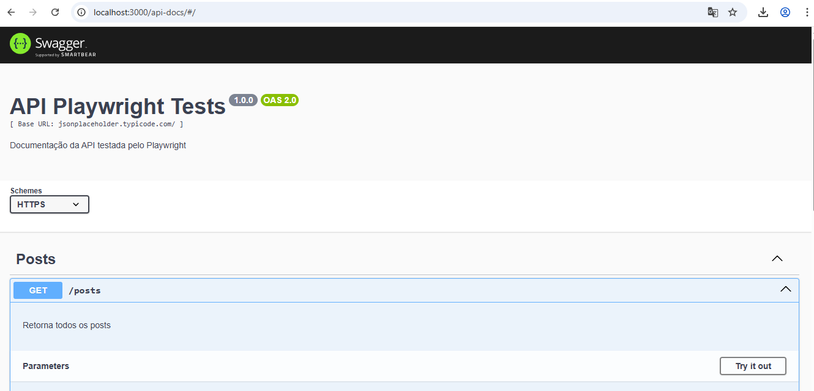
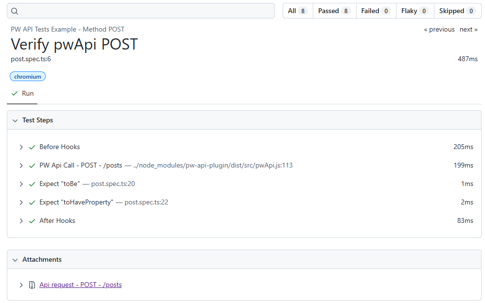

#  Testes Automatizados de API com Playwright + pw-api-plugin


Repositório com testes automatizados de **API** usando o [Playwright](https://playwright.dev/), integrados ao plugin [`pw-api-plugin`](https://www.npmjs.com/package/pw-api-plugin).  
O plugin permite visualizar detalhes de cada requisição HTTP diretamente na **interface do Playwright UI** e nos **relatórios de execução**.  
A documentação da API é gerada automaticamente com **Swagger Autogen**.

---
## 📖 Documentação da API

A documentação é gerada automaticamente usando [`swagger-autogen`](https://github.com/davibaltar/swagger-autogen).

- JSON gerado: [`docs/swagger-output.json`](./docs/swagger-output.json)
- Interface Swagger UI: [http://localhost:3000/api-docs](http://localhost:3000/api-docs)


### ▶️ Como gerar e visualizar a doc Swagger

1. Gerar o arquivo `swagger-output.json`:
```bash
npx ts-node docs/generate-swagger.ts
```

2. Subir o servidor local com Swagger UI:
```bash
npx ts-node docs/swagger-server.ts
```

3. Abrir no navegador:
👉 [http://localhost:3000/api-docs](http://localhost:3000/api-docs)



---

## 🔧 Tecnologias & Ferramentas

- 🎭 **Playwright** — framework para automação moderna
- 🔌 **pw-api-plugin** — exibe chamadas HTTP no Playwright UI
- 🧪 **GitHub Actions** — integração contínua (CI)
- 💻 **Node.js** — ambiente de execução JavaScript
- 📑 **Swagger Autogen** — gera documentação da API automaticamente

---
## 📁 Estrutura do Projeto
```api-playwright-tests/
├── docs/
│   ├── generate-swagger.ts   # Script para gerar o Swagger JSON
│   ├── swagger-helper.ts     # Endpoints fake para Swagger Autogen
│   ├── swagger-output.json   # JSON gerado automaticamente
│   └── swagger-server.ts     # Servidor Swagger UI
├── tests/                    # Casos de testes automatizados
├── .github/workflows/        # Workflows do GitHub Actions
├── playwright.config.ts      # Configuração do Playwright
├── package.json              # Configurações e scripts
└── README.md                 # Documentação
```
---
## ✅ Requisitos
	•	Node.js v18 ou superior
	•	npm ou yarn
---
## 📦 Instalação

Clone o repositório e instale as dependências:

```bash
git clone https://github.com/ciboto/api-playwright-tests.git
cd api-playwright-tests
npm install
```
---
## Como Executar os Testes
1. Executar testes via CLI:
- Mode UI:
```
LOG_API_UI=true LOG_API_REPORT=true npx playwright test --ui
```
- Mode Headless:
 ```
LOG_API_REPORT=true npx playwright test
```
2. Abrir Report da execução local:
```
npx playwright show-report
```

---
## 📊 Relatórios com pw-api-plugin

Com o pw-api-plugin, o relatório do Playwright mostra:
- Detalhes das chamadas HTTP feitas nos testes
- Payload de requisição e resposta
- Códigos de status, tempo de resposta e cabeçalhos
- Visualização embutida no Playwright UI


---

## ⚙️ Integração com GitHub Actions

Os testes automatizados são executados via GitHub Actions, acionados automaticamente por eventos de push e pull request, ou manualmente através da opção workflow dispatch.

## 📁 Exemplo de workflow (.github/workflows/playwright.yml):
```yaml

name: Playwright Tests

on:
  push:
    branches: [main]
  pull_request:
  workflow_dispatch:

permissions:
  contents: read
  pages: write
  id-token: write

jobs:
  test-e2e-api:
    timeout-minutes: 60
    runs-on: ubuntu-latest
    steps:
    - uses: actions/checkout@v4
    - uses: actions/setup-node@v4
      with:
        node-version: lts/*

    - name: Install dependencies
      run: npm ci

    - name: Install Playwright Browsers (only Chromium)
      run: npx playwright install chromium --with-deps

    - name: Run Playwright API tests
      env:
        LOG_API_REPORT: 'true'
      run: npx playwright test
      
    - uses: actions/upload-artifact@v4
      if: ${{ !cancelled() }}
      with:
        name: playwright-report
        path: playwright-report/
        retention-days: 30

  deploy-report-gh-pages:
    needs: test-e2e-api
    if: ${{ github.event_name == 'workflow_dispatch' }}
    runs-on: ubuntu-latest

    steps:
    - name: Download Artifact Report HTML
      uses: actions/download-artifact@v4
      with:
        name: playwright-report
        path: ./report

    - name: Configure GitHub Pages
      uses: actions/configure-pages@v5

    - name: Send Report to GitHub Pages
      uses: actions/upload-pages-artifact@v3
      with:
        path: ./report 

    - name: Deploy GitHub Pages
      uses: actions/deploy-pages@v4
```
---
 
##  📄 Relatório de Testes (GitHub Pages)
Os testes automatizados são executados automaticamente via GitHub Actions e o **relatório Playwright HTML** é publicado no GitHub Pages após rodar manualmente o workflow nas actions.
📍 Acesse o relatório mais recente:

 - [📊 Relatório Executado](https://ciboto.github.io/api-playwright-tests/)

---
## 📌 Observações
	•	Este projeto é voltado para testes de API, mas pode ser facilmente adaptado para testes E2E.
	•	O pw-api-plugin funciona bem em conjunto com o modo headless ou UI.
  • A documentação Swagger é fake (usando swagger-helper.ts), simulando endpoints para estudo de automação de APIs.

---
## ⚖️ Licença
Este projeto está licenciado sob a [CC BY-NC-ND 4.0](https://creativecommons.org/licenses/by-nc-nd/4.0/) - Consulte o arquivo [LICENSE](./LICENSE) para mais detalhes.
